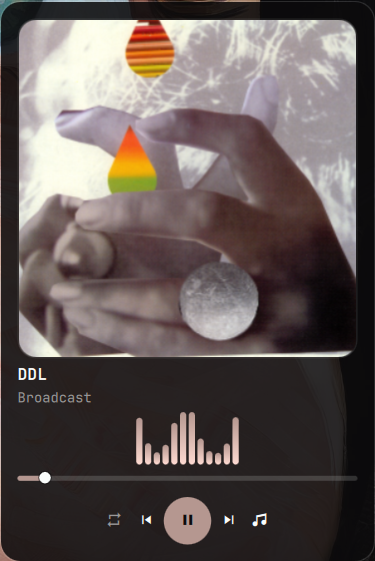

# kokko.mpd

**Your MPD in the Omarchy bar.** What is playing right now, with cover — and one
click opens the whole player: queue, search, library, playlists. Everything works
with the mouse; the keys are a bonus.


## What it does

- **In the bar** — the current track as a label (scrolling or truncating, your
  choice), a play state glyph, middle click = next track, scroll = volume/seek/track.
- **On hover** — the same music as a card under the bar: cover, progress you can
  drag to seek, **big** buttons ⏮ ⏸ ⏭, shuffle/repeat, volume on the wheel.
- **On the wallpaper** — the same card as a desktop widget: cover, live spectrum,
  progress, five transport buttons. It sits under the windows and is visible where
  the desktop is free; one setting lifts it above them.
- **In the panel** — transport, spectrum (cava), queue, library, file tree and saved
  playlists in one place, with the playing cover softly behind the list.
- **Searching like on the web** — hits appear grouped by **artist** and **album**
  while you type. `+` on a row appends what that row *is*.
- **Searching this category only** — in albums, artists and genres, `/` searches
  what you are looking at, not the whole library. Case never matters.
- **Cleaning up** — a bin per row, clear the whole queue, or keep only the playing
  track. One click, immediately, with feedback.
- **On every new track** — a card at the bottom for a moment, optionally a desktop
  notification with cover. Both switch off separately.
- **Settings in the panel** — tab **8** holds the twelve values you actually touch
  while listening, with live preview, plus the two library actions (update and
  rescan). No JSON editing.

## Getting started

The plugin is not in the Omarchy marketplace yet, so bring it in with git:

```bash
omarchy plugin add https://github.com/taschenlampe/kokko.mpd.git --enable
omarchy plugin enable kokko.mpd --section center
omarchy restart shell
```

Updates then come from Omarchy itself:

```bash
omarchy plugin update kokko.mpd
```

**By hand**, if you prefer a folder you control — the directory name has to be the
plugin id, because that is what `shell.json` and the CLI refer to:

```bash
git clone https://github.com/taschenlampe/kokko.mpd.git \
  ~/.config/omarchy/plugins/kokko.mpd
omarchy plugin enable kokko.mpd --section center
omarchy restart shell
```

A hand-made clone is unknown to `omarchy plugin update`, so it updates with a plain
`git pull` in the plugin folder. Removing works either way:
`omarchy plugin remove kokko.mpd`.

**What it needs.** A running MPD on `127.0.0.1:6600` (empty password by default, both
changeable in the plugin settings). The bridge uses nothing but the Python standard
library — no `mpc`, no extra packages. `cava` is optional: it draws the spectrum in
the bar, everything else works without it.

Panel toggle: **`SUPER + CTRL + M`**.

## The views

**Bar and card.** The label with cover and transport, and the card that appears
when you point at the bar.


**Queue.** The band on top — cover, progress, spectrum, one controller. The row
that is playing carries an accent-coloured bar on its left edge, so it stays
findable while you scroll; `t` jumps back to it from any tab.


**Search.** Hits grouped, `+` appends, `enter` plays.


**Settings.** Twelve values and the two library actions, directly operable.


**On track change.** Brief, with cover, disappears by itself.


**On the wallpaper.** Cover, live spectrum, progress and the transport, sitting on
the desktop under every window — here on a clear workspace, where it has room.
Clicks land on the card and nowhere else.



## Using it — the short way

### Getting something into the queue: three moves

1. **Search**: press `/` and type (or open the search tab).
2. **`+` on the right of the row** — appends what that row is: the track, the
   album, everything by that artist.
3. **`enter`** plays it right away instead of appending.

That is all you need to know. (If you like: `a` is the keyboard version of `+`,
`A` appends the whole hit list.)

### Bar

| Mouse | Effect |
| --- | --- |
| left click | open/close the panel |
| middle click | next track |
| scroll | volume (configurable: seek or track) |
| pointer on it | card with cover, progress and buttons |

### Card

Click opens the panel, the buttons control directly, dragging over the progress
seeks, the wheel over the card changes the volume. The toggles on the right set
shuffle and repeat — accent colour means on.

### Panel

`←`/`h`, `esc` and `backspace` go one level back; the footer always says which key
does what right here. At the start, `esc` closes the panel.

## If you like keys

| Key | Effect |
| --- | --- |
| `1` … `8`, `tab` | queue · search · albums · artists · genres · files · playlists · settings |
| `t` | **jump to the playing track** — from any tab: switches to the queue and centres it |
| `<` `>` | previous / next track (the binding of `ncmpcpp`, not of `mpc` — that one writes `prev`/`next`) |
| `/` | **field for what you are looking at**: in albums/artists/genres it searches that category only ("albums · danzig"), in files/playlists it filters the loaded list ("4 of 19", `esc` shows everything again) — in the queue and in search it stays the global search. **Case never matters** ("iam" finds "IAM" too) |
| `j` `k`, `↑` `↓`, `pgup` `pgdn`, `g` `G` | move |
| `enter` | open or play |
| `a` / `A` | append what the row is / everything in this list |
| `+` `-` · `,` `.` · `space` | louder/quieter · 5 s back/forward · play/pause |
| `z` `R` `c` `v` | shuffle, repeat, consume, single |
| `d` `D` `C` | delete row · clear queue · keep only the playing track |
| `J` `K` `x` | move a queue entry · shuffle the queue |
| `i` / `/` / `s` / `r` | song info · search · save queue · rename playlist |

<details>
<summary>All keys in detail</summary>

- **Search:** `↓` leaves the field and selects the **first** hit, `↑` the **last** —
  the term stays, `/` brings the field back, `ctrl+u` clears it.
- **Digits** keep switching tabs while the search field is empty: `1` `2` `3`
  goes queue → search → albums without landing in the field as "123". Only with
  text in the field do digits become search text; a search starting with a digit
  is opened with `/` (the announcement "I want to type").
- **`enter` in the search field** takes the selected hit: a track plays, a group
  opens.
- **An album from the hits** opens through the albums of its artist — from the
  tracks, `h`/`esc` therefore goes to the **other albums** first, and one more
  time back to the hits.
- **Back** always works with `h`, `←`, `backspace` or `esc`; `esc` clears from the
  top down: song info, one level, panel.
- **Artists without album tags** (samplers): straight to the tracks instead of an
  empty album list.
- For **saved playlists**, MPD's `playlist_directory` has to exist
  (`~/.config/mpd/mpd.conf`).

</details>

## Settings

Tab **8** in the panel — click or `enter` toggles, `-`/`+` (or the `−`/`+` buttons
right on the row) change numbers, `enter` on the label format opens an input field.
While you are there, the footer shows what the pattern does to the **playing track**.

The rows are grouped by surface, in the order the sections above introduce them.
The group heading carries the context, which is why the row itself stays short —
"Size" instead of "Card size (desktop)".

| Setting | Effect |
| --- | --- |
| **In the bar** | |
| Format | `mpc` placeholders for the bar label, with live preview |
| **On hover** | |
| Show the card | the card under the bar (only while the panel is closed — open, it is already the big view) |
| **In the player** | |
| Cover look | **seven looks** for the band: `classic`, `sharp`, `hero`, `anchor`, `vinyl`, `minimal`, `split` — `enter` or `-`/`+` cycles, applies at once |
| Backdrop | presence of the cover in the panel, 0 switches it off; higher values let it **run further down** (behind the last row), not just stronger |
| **On a new track** | |
| Show the card | flashes on every new track — switch it off entirely here |
| For how long | how long it stays then; `enter` shows it right now |
| Notification | the desktop's bubble (app "MPD") — **independent of the card** |
| **On the wallpaper** | |
| Show the card | the card on your desktop instead of only in the bar — same cover, same live spectrum, same buttons |
| Size | `card` (full, with spectrum) or `mini` (narrow, no spectrum) |
| Position | which corner it takes — `bottom-right`, `bottom-left`, `top-right`, `top-left` or `center` |
| Layer | `desktop` keeps it under every window, so it shows where the desktop is free; `above` floats it over them, which also survives fullscreen video |
| Dim when paused | fades it while playback is stopped, so a paused card does not compete with your work |
| **Music library** | |
| Update | reads new and changed files — the everyday one after adding music; MPD works through it in the background |
| Rescan | re-reads everything and drops entries for files that are gone — use it after deleting or renaming; slow when the library is on a network share |


<details>
<summary>The seven looks for the band</summary>

**Seven looks for the band** (`Cover look`) — same data, seven pictures:


| Look | What it does | Price |
| --- | --- | --- |
| `classic` | softly drawn cover behind the panel, 58 px in the band | — |
| `sharp` | the same band with an 88 px cover, and the cover behind the panel stays an **image** (opacity + gradient instead of blur) | at a high "Backdrop" it is more present than the soft one — turn the slider down if needed |
| `hero` | the cover **is** the background of the player card, panel flat | band is taller: roughly two list rows less |
| `anchor` | big cover (104 px), everything else text and **one** control row, panel flat | band is taller: roughly two list rows less |
| `vinyl` | the cover spins inside a **round disc** — rim line and a spindle dot at the centre, and it stops where you paused | — (same band height as `sharp`) |
| `minimal` | **no artwork at all** — one thin line: title, progress, transport | 38 px: three more list rows than `classic` |
| `split` | the cover becomes a full-height **column** on the left, title and year beside it, controls bottom right | third tallest band (112 px) |

</details>

Beyond the tab, the connection (server, port, password) and a few display details
(label width, wheel behaviour) are set with the CLI or in
`~/.config/omarchy/shell.json` — all keys are listed in
[docs/internals.md](docs/internals.md). Changes apply without a restart.

## Origin

`bin/mpd-bridge` and `Format.js` come from
[matjam/omajam](https://github.com/matjam/omajam) (MIT, copyright (c) 2026 Nathan
Ollerenshaw) — see `NOTICE.md` for the changes. `BarWidget.qml`, `Panel.qml`,
`MiniPlayer.qml` and `Visualizer.qml` are original work.

The plugin lives in its own repo: **https://git.m2control.de/bm/kokko.mpd** — bugs,
wishes and the roadmap (with labels, milestone and a "done when" per entry) live in
its issue tracker, not in a chat that is forgotten tomorrow. There is deliberately
no open-items list in this file.

## More

- **[docs/internals.md](docs/internals.md)** — how it works inside: the bridge, cover
  picking, MPD quirks, the command line, Hyprland bindings.
- **[CONTRIBUTING.md](CONTRIBUTING.md)** — tests, the pre-commit hook, and what not
  to change.
