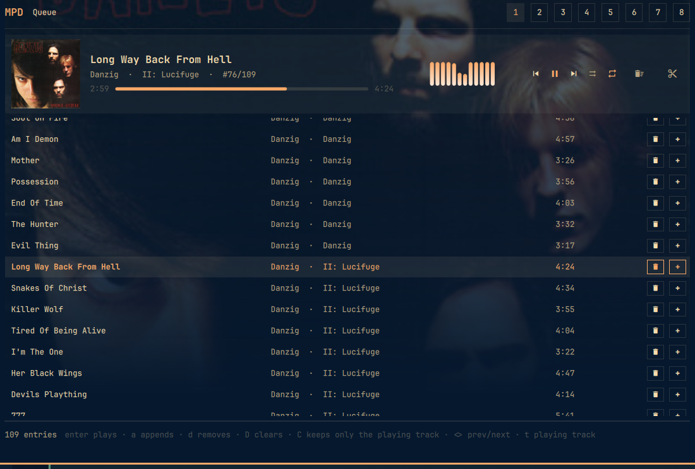
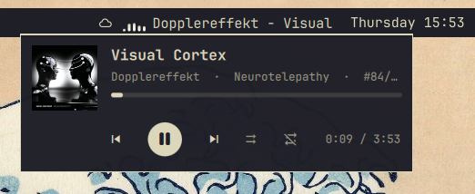
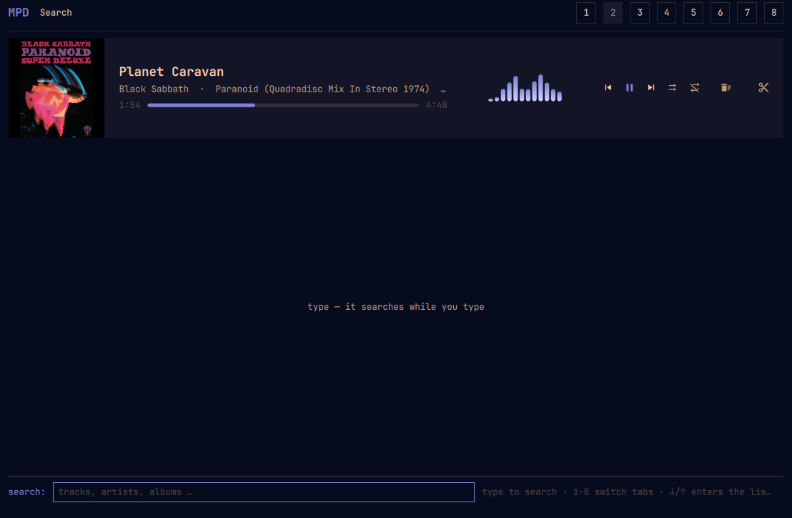
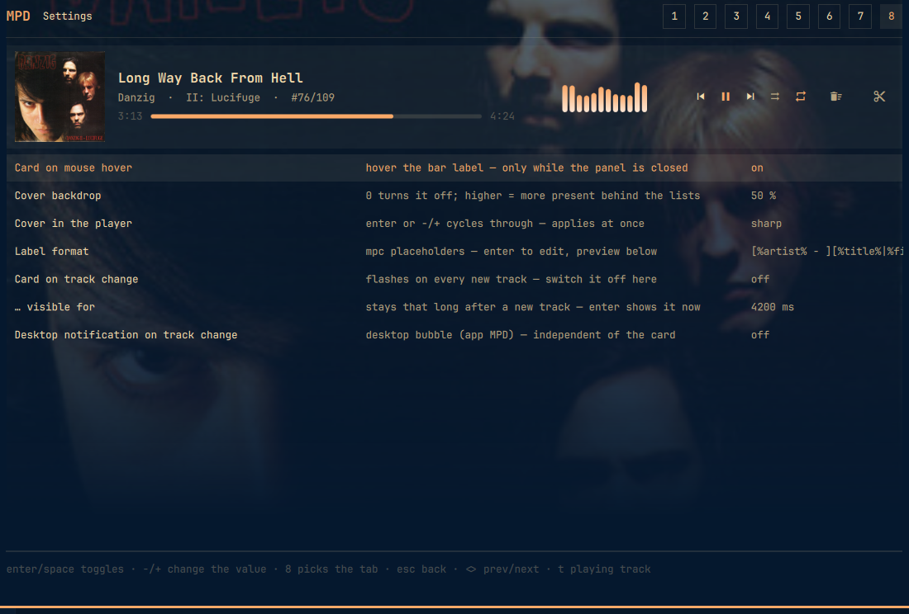
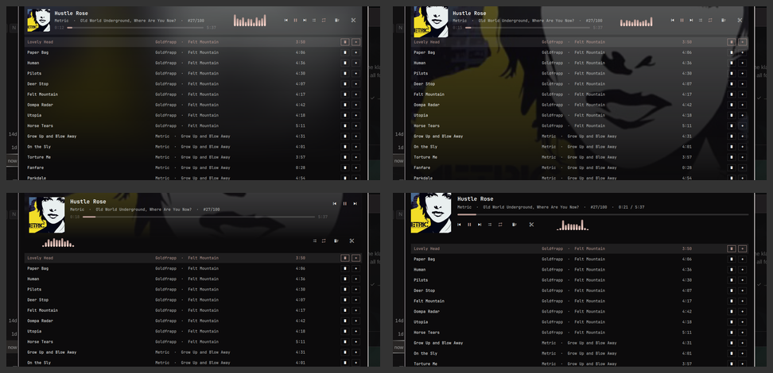

# kokko.mpd

**Your MPD in the Omarchy bar.** What is playing right now, with cover — and one
click opens the whole player: queue, search, library, playlists. Everything works
with the mouse; the keys are a bonus.



## What it does

**In the bar** — a label with the current track (scrolling or truncating, your
choice), a play state glyph, middle click = next track, scroll = volume/seek/track.

**On hover** — the same music as a card under the bar: cover, progress (drag it to
seek), **big** buttons ⏮ ⏸ ⏭, shuffle/repeat, volume on the wheel. It stays open
while the pointer is on the bar or the card.

**In the panel** — transport, spectrum (cava), queue, library, file tree and saved
playlists in one place. The current track's cover sits softly in the background,
its presence controlled by a slider.

**Searching like on the web** — type, hits appear grouped by **artist** and
**album** while you type. `+` on a row appends what that row *is* — a single track,
a whole album, everything by one artist.

**Searching this category only** — in albums, artists and genres, `/` does not
search the whole library but only what you are looking at ("Albums · danzig",
2 rows instead of 1789). Case does not matter: "iam" finds "IAM" too.

**Cleaning up** — a bin per row, clear the whole queue, or keep only the playing
track. One click, immediately, with feedback.

**On every new track** — a card at the bottom for a moment, optionally a desktop
notification with cover. Both can be switched off separately.

**Settings in the panel** — tab **8** holds the seven values you actually touch
while listening, with live preview. No JSON editing needed.

## Getting started

```bash
omarchy plugin enable kokko.mpd --section center
omarchy restart shell
```

On first start it connects to MPD on `127.0.0.1:6600` (changeable in the plugin
settings). Panel toggle: **`SUPER + CTRL + M`**.

## The views

**In the bar, and on hover.** The label with cover and transport, and the card that
appears when you point at the bar.



**Queue — the player.** The band on top: cover, progress, spectrum, one controller.
Below it the queue, at the bottom what is happening and what the keys do. When it
opens, the **selection sits on the playing track** and the list is scrolled there —
with 300 entries, the top would be the one place where the music is not. `t` jumps
back there any time (from any tab, too).


**Search.** Hits grouped, `+` appends, `enter` plays.



**Settings.** Seven values, directly operable.



**On track change.** Brief, with cover, disappears by itself.


## Using it — the short way

### Getting something into the queue: three moves

1. **Search**: press `/` and type (or open the search tab).
2. **`+` on the right of the row** — appends what that row is: the track, the
   album, everything by that artist.
3. **`enter`** plays it right away instead of appending.

That is all you need to know. (If you like: `a` is the keyboard version of `+`,
`A` appends the whole hit list.)

### Bar

| Mouse | Effect |
| --- | --- |
| left click | open/close the panel |
| middle click | next track |
| scroll | volume (configurable: seek or track) |
| pointer on it | card with cover, progress and buttons |

### Card

Click opens the panel, the buttons control directly, dragging over the progress
seeks, the wheel over the card changes the volume. The toggles on the right set
shuffle and repeat — accent colour means on.

### Panel

`←`/`h`, `esc` and `backspace` go one level back; the footer always says which key
does what right here. At the start, `esc` closes the panel.

## If you like keys

| Key | Effect |
| --- | --- |
| `1` … `8`, `tab` | queue · search · albums · artists · genres · files · playlists · settings |
| `t` | **jump to the playing track** — from any tab: switches to the queue and centres it |
| `<` `>` | previous / next track (the binding of `ncmpcpp`, not of `mpc` — that one writes `prev`/`next`) |
| `/` | **field for what you are looking at**: in albums/artists/genres it searches that category only ("albums · danzig"), in files/playlists it filters the loaded list ("4 of 19", `esc` shows everything again) — in the queue and in search it stays the global search. **Case never matters** ("iam" finds "IAM" too) |
| `j` `k`, `↑` `↓`, `pgup` `pgdn`, `g` `G` | move |
| `enter` | open or play |
| `a` / `A` | append what the row is / everything in this list |
| `+` `-` · `,` `.` · `space` | louder/quieter · 5 s back/forward · play/pause |
| `z` `R` `c` `v` | shuffle, repeat, consume, single |
| `d` `D` `C` | delete row · clear queue · keep only the playing track |
| `J` `K` `x` | move a queue entry · shuffle the queue |
| `i` / `/` / `s` / `r` | song info · search · save queue · rename playlist |

<details>
<summary>All keys in detail</summary>

- **Search:** `↓` leaves the field and selects the **first** hit, `↑` the **last** —
  the term stays, `/` brings the field back, `ctrl+u` clears it.
- **Digits** keep switching tabs while the search field is empty: `1` `2` `3`
  goes queue → search → albums without landing in the field as "123". Only with
  text in the field do digits become search text; a search starting with a digit
  is opened with `/` (the announcement "I want to type").
- **`enter` in the search field** takes the selected hit: a track plays, a group
  opens.
- **An album from the hits** opens through the albums of its artist — from the
  tracks, `h`/`esc` therefore goes to the **other albums** first, and one more
  time back to the hits.
- **Back** always works with `h`, `←`, `backspace` or `esc`; `esc` clears from the
  top down: song info, one level, panel.
- **Artists without album tags** (samplers): straight to the tracks instead of an
  empty album list.
- For **saved playlists**, MPD's `playlist_directory` has to exist
  (`~/.config/mpd/mpd.conf`).

</details>

## Settings

Tab **8** in the panel — click or `enter` toggles, `-`/`+` (or the `−`/`+` buttons
right on the row) change numbers, `enter` on the label format opens an input field.
While you are there, the footer shows what the pattern does to the **playing track**.

In this tab the band keeps a fixed height (the tallest look's), so cycling through
the looks never moves the rows under your pointer. Everywhere else each look keeps
its own height — there the look does not change while you watch it.

| Setting | Effect |
| --- | --- |
| Card on mouse hover | the card under the bar (only while the panel is closed — open, it is already the big view) |
| Cover backdrop | presence of the cover in the panel, 0 switches it off; higher values let it **run further down** (behind the last row), not just stronger |
| Cover in the player | **four looks** for the band: `classic`, `sharp`, `hero`, `anchor` — `enter` or `-`/`+` cycles, applies at once |
| Label format | `mpc` placeholders for the bar label, with live preview |
| Card on track change | flashes on every new track — switch it off entirely here |
| … visible for | how long it stays then; `enter` shows it right now |
| Desktop notification on track change | the desktop's bubble (app "MPD") — **independent of the card** |

**Four looks for the band** (`Cover in the player`) — same data, four pictures:



| Look | What it does | Price |
| --- | --- | --- |
| `classic` | softly drawn cover behind the panel, 58 px in the band | — |
| `sharp` | the same band with an 88 px cover, and the cover behind the panel stays an **image** (opacity + gradient instead of blur) | at a high "Cover backdrop" it is more present than the soft one — turn the slider down if needed |
| `hero` | the cover **is** the background of the player card, panel flat | band is taller: roughly two list rows less |
| `anchor` | big cover (104 px), everything else text and **one** control row, panel flat | band is taller: roughly two list rows less |

Everything else (server, port, password, label width, scroll behaviour, card
duration on hover) lives in the plugin settings or in `shell.json`; changes apply
without a restart.

## For the curious

**Searching in a category.** In the library tabs, `/` does not search globally but
in *that* category: `list artist "(artist =~ '(?i)iam')"` — MPD does the filtering.
Two MPD quirks are in there: `contains` compares **case-sensitively** in the `list`
filter ("iam" found 5 artists, "IAM" was not among them), the regex operator `=~`
with `(?i)` finds both — hence the regex, with `re.escape` for special characters
and a fallback to `contains` if an MPD was built without regex. And MPD wants the
whole expression as **one** argument (otherwise it splits it at the spaces:
"Invalid unquoted character"). Two categories at once do not work: this MPD
combines filters with `AND` only, not with `OR` — which is exactly the "this
category only" idea. In the *global* search (tab 2) case does not matter anyway,
that is MPD's own search. Files and playlists have no filter in MPD (paths and
playlist names are not tags); there the field filters the loaded list on the spot,
the info line says "4 of 19", and `esc` shows everything again. On MPD 0.20 (NAS)
that becomes an exact match instead of a partial one.

**Cover files.** Over `albumart`, MPD only hands out image files whose names it
knows — in MPD 0.24 that is `cover.*`. A `folder.jpg` next to it is ignored
(measured: `albumart` answers "No file exists" for `folder.jpg`, `album.jpg` or
`Album Art.jpg`; the same bytes give a result as soon as a `cover.jpg` exists).
That is why the bridge searches the music directory itself (path from MPD's
`mpd.conf`, `music_directory`) — by patterns, not by a fixed name list:

| Rank | Matches | Example |
| --- | --- | --- |
| 1 | `cover`, `front`, `folder`, `album`, `album art`, `albumart`, `artwork` (exact) | `folder.jpg` |
| 2 | "front" + "cover/art" anywhere | `Danzig - Danzig - Front Cover.jpg` |
| 3 | "cover", "artwork" or "album art" anywhere | `AlbumArt_{0F838ADF-…}_Large.jpg` |
| 4 | `case`, `scan`, `cd`, `thumb` (exact) | — |

Within a rank the **bigger** file wins (usually the less cropped scan). Names that
usually show the wrong side — `back`, `inside`, `inlay`, `booklet`, `small`, `disc`,
`cd`, `thumb` — are sorted to the end: an album with only a back cover scan shows
that one, but a front always wins. Allowed extensions: `.jpg .jpeg .png .webp .gif
.bmp`. Embedded images come through `readpicture` unchanged; a cover file beats
them, because it is usually the bigger one — the same order MPD itself chooses.
Important: the files have to be readable for the user the bridge runs as (usually
no problem with a library on a NAS).

<details>
<summary>Structure, command line, fine tuning</summary>

**Covers** appear where they are seen: big in the band, small in the header, big in
the song info — not in every queue row (with 300 entries that would be 300 MPD
queries and 300 images). The bridge caches them under `~/.cache/kokko-mpd`.

**Spectrum** comes from **cava** (`bin/cava.conf`, 12 bars, 30 fps) and runs only
while music plays *and* the panel is open — unseen it would be work for nobody.

**The bridge** (`bin/mpd-bridge`, Python, stdlib only) holds the MPD connections
and talks to the widget in one JSON line per direction; state arrives by MPD
`idle` push, not by polling. It is a **child process of the widget**, not a shell
service — under a third-party bar (`charlieras262.floating-bar`) a widget cannot
reach its own service. The price: one bridge per monitor.

**The card** is a layer surface of its own with an input mask only over the card
(the rest stays click-through) and is created only while it is visible. No
`PopupWindow`: a Quickshell popup on a layer surface makes screen recording hang in
this compositor.

**Appending** is always *one* MPD command (`findadd`/`searchadd`), not `add` per
track — an artist with 900 tracks costs one query. Every action reports in the
footer.

**Settings** live in `~/.config/omarchy/shell.json` in the widget entry:
`host`, `port`, `password`, `format`, `maxWidth`, `overflow`, `showArt`,
`showStateIcon`, `whenIdle`, `wheelAction`, `hoverCard`, `backdrop`,
`osdOnChange`, `osdOnHover`, `osdDuration`, `notifyTrack`, `coverLook`.

**From the command line:**

```bash
omarchy-shell kokko.mpd state                 # JSON: connection, label, panel, card
omarchy-shell -q kokko.mpd toggle             # play/pause (next, prev, stop as well)
omarchy-shell -q kokko.mpd volume +5          # sign = nudge, number = set
omarchy-shell -q kokko.mpd option random      # repeat, random, single, consume
omarchy-shell kokko.mpd panel                 # panel on/off
omarchy-shell kokko.mpd tab artists           # set the tab
omarchy-shell kokko.mpd find "kate bush"      # run a search
omarchy-shell kokko.mpd key j                 # simulate a key press
omarchy-shell kokko.mpd hover on              # show the card without a mouse (screenshots/tests)
omarchy-shell kokko.mpd debug on              # protocol to the shell log
```

**Hyprland** (`~/.config/hypr/bindings.lua`):

```lua
o.bind("SUPER + CTRL + M", "MPD player", "omarchy-shell kokko.mpd panel")
o.bind("XF86AudioPlay", "Play/pause", "omarchy-shell -q kokko.mpd toggle", { locked = true })
o.bind("XF86AudioNext", "Next track", "omarchy-shell -q kokko.mpd next", { locked = true })
o.bind("XF86AudioPrev", "Previous track", "omarchy-shell -q kokko.mpd prev", { locked = true })
```

</details>

## Tests

Everything that can be checked without a click runs in one call:

```sh
tests/run.sh            # everything, including a smoke test against a running MPD
tests/run.sh --fast     # without MPD -- that is what the pre-commit hook uses
tests/install-hooks.sh  # once per clone: activates the hook
```

The hook is the actual reason the tests exist: **a QML syntax error is invisible
here** — the shell starts, the widget is simply gone, without a message. `qmllint`
finds it (`omarchy plugin validate` does not), which is why it runs before every
commit. In an emergency: `git commit --no-verify`.

Two things are checked. Without MPD: the pure Python parts of the bridge — cover
picking with its ranking and size limit, the filter expression with both escaping
layers, the cache key, the image type, `music_directory` from `mpd.conf`. Plus
`qmllint` and `omarchy plugin validate`. With a running MPD: that the bridge
answers, fetches a cover, and that titles with special characters (`#1's …`,
`( O )( O )( O ), cl-018`) find themselves through the filter expression.

What is **not** possible automatically is filed as an issue in the repo (mouse
paths, `crop`) — those need a human with a pointer.

## Origin

`bin/mpd-bridge` and `Format.js` come from
[matjam/omajam](https://github.com/matjam/omajam) (MIT, copyright (c) 2026 Nathan
Ollerenshaw) — see `NOTICE.md` for the changes. `BarWidget.qml`, `Panel.qml`,
`MiniPlayer.qml` and `Visualizer.qml` are original work.

The plugin lives in its own repo with an issue tracker:
**https://git.m2control.de/bm/omarchympd** — bugs and wishes belong there, not in a
chat session that is forgotten tomorrow.

## Later / open

The open items live in the **issue tracker** of the repo
(https://git.m2control.de/bm/omarchympd/issues) — with labels, milestone and a
"done when" per entry. Sorted by usefulness, not by effort:

1. **Walk the mouse paths by hand** — the four band looks, dragging the progress,
   🗑 and `+` in the list rows, `crop`. Keyboard and IPC paths are checked, real
   clicks are not (not triggerable in this VM).
2. **Make cava visible when it is missing** — otherwise the band stays silently
   empty instead of saying "cava missing".
3. **Category search in the queue too** (`playlistsearch`).
4. **Shipping**: tag, release and `omarchy plugin add`; after that the marketplace
   listing (for that the repo would have to be public).
5. **Small stuff**: selectable list sorting, look fine tuning, two safeguards and
   comments in the bridge — the exact scopes and the reason why two of them are
   *not* bugs are in the issues.

Deliberately **not** planned: splitting `bin/mpd-bridge` into modules or rewriting
it to `with_cmd`. The file is a maintained copy of omajam (see `NOTICE.md`); a
module split would destroy the upstream comparison and cost more than the
structure brings in.
